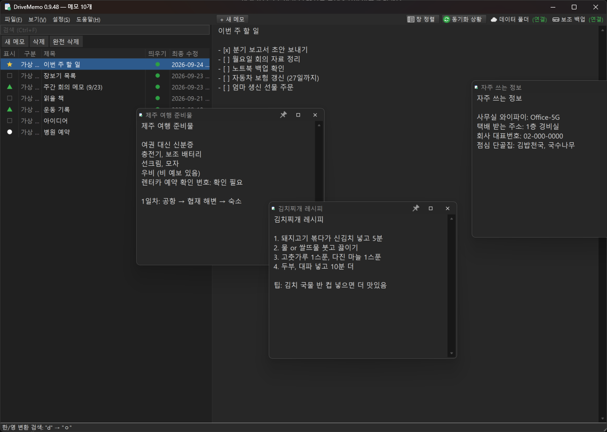
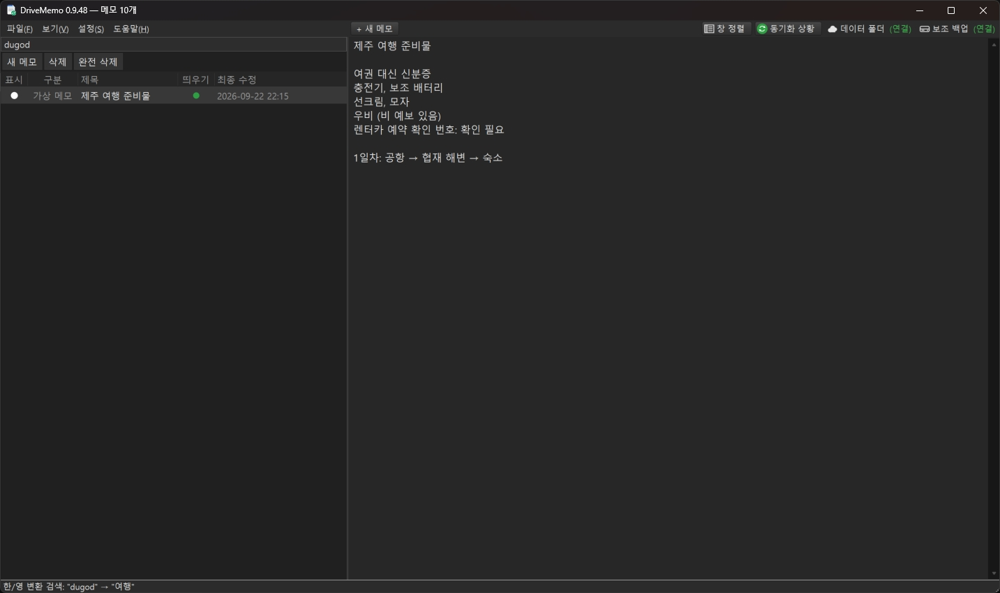

# DriveMemo

**집 PC, 회사 PC, 노트북에서 같은 메모를 쓰는 가벼운 윈도우 메모장**

윈도우 메모장처럼 가볍게 열어서 바로 쓰고, 저장 버튼 없이 자동 저장됩니다.
메모를 구글 드라이브 폴더에 두기 때문에, 구글 드라이브 앱이 깔린 PC라면 어디서든 같은 메모가 몇 초 안에 맞춰집니다.
별도 서버나 회원 가입은 없습니다.

## 다운로드

### ⬇ [DriveMemo 0.9.49 받기 (DriveMemo-0.9.49.zip)](https://github.com/subisubi99/DriveMemo-releases/raw/main/DriveMemo-0.9.49.zip)

1. 압축을 원하는 폴더에 풉니다. (예: `C:\Tools\DriveMemo`)
2. `DriveMemo.exe`를 실행합니다. 설치 과정은 없습니다.
3. 처음 실행할 때 구글 드라이브 폴더를 찾아서 "여기에 메모를 저장할까요?"라고 묻습니다. **예**를 누르면 끝입니다.

> **"Windows의 PC 보호" 창이 뜨면** **추가 정보 → 실행**을 누르세요.
> 개인이 만든 프로그램이라 코드 서명이 없어서 뜨는 안내이며, 처음 한 번만 뜹니다.

**준비물**: Windows 10 / 11. 여러 PC에서 함께 쓰려면 각 PC에 [Google Drive 데스크톱 앱](https://www.google.com/drive/download/)을 설치하고 같은 계정으로 로그인하세요. (PC 한 대에서만 쓴다면 필요 없음)

## 이런 분께 추천합니다

- 집과 회사에서 같은 메모를 보고 고치고 싶은 분
- 메모장에 적어 두고 저장을 깜빡해서 날려 본 분
- 메모 앱은 무겁고, 윈도우 메모장은 너무 단순하다고 느끼는 분

## 주요 기능

**쓰기**
- 입력을 멈추면 1.5초 뒤 자동 저장. 저장 버튼이 없습니다.
- 첫 줄이 제목이 되어 목록에 표시됩니다.
- 메모 1개 = 텍스트 파일 1개. DriveMemo가 없어도 메모장으로 열어 볼 수 있습니다.

**여러 PC 동기화**
- 다른 PC에서 고친 메모가 몇 초 안에 반영됩니다.
- 같은 메모를 두 PC에서 동시에 고치면 한쪽을 "충돌 사본"으로 따로 남겨서, 어느 쪽 내용도 잃지 않습니다.
- 구글 드라이브가 끊겨 있어도 계속 쓸 수 있고, 다시 연결되면 자동으로 반영됩니다.
- 테마, 정렬, 칸 폭 같은 설정도 PC 간에 공유됩니다.

**찾기와 정리**
- 전체 내용 검색. 한/영 전환을 깜빡하고 쳐도 찾아 줍니다. (`dugod` → `여행`)

  

- 표식(○ △ ★)으로 중요한 메모 표시
- 최종 수정순 / 작성 날짜순 / 이름순 / 직접 끌어서 순서 정하기

**보기**
- 메모를 목록 밖으로 끌어내면 별도 창으로 띄워서 옆에 두고 볼 수 있습니다. 항상 위 고정도 됩니다.
- 밝은 / 어두운 테마, 트레이 아이콘, 윈도우 시작 시 자동 실행

**그 밖에**
- 일반 txt 파일도 끌어다 놓으면 메모장처럼 열어서 고칠 수 있습니다. (원래 인코딩·줄바꿈 유지)
- NAS·외장 하드 같은 곳에 한 벌 더 보관하는 보조 백업
- 프로그램 안에서 새 버전 확인과 업데이트

## 안심하고 쓰셔도 되는 이유

- **메모는 내 PC와 내 구글 드라이브에만 저장됩니다.** 제작자를 포함해 누구에게도 전송되지 않습니다.
- DriveMemo가 인터넷에 접속하는 경우는 **업데이트 확인** 한 가지뿐입니다. 이 페이지의 버전 정보 파일(`latest.txt`)을 읽습니다. 환경 설정에서 자동 확인을 끌 수 있습니다.
- 업데이트 파일은 받은 뒤 확인값(SHA-256)을 검사하고 나서 바꿉니다.
- 메모는 평범한 텍스트 파일이라, DriveMemo를 지워도 메모는 그대로 남습니다.

## 업데이트

DriveMemo 안에서 **도움말 → 업데이트 확인**을 누르면 새 버전을 받아서 바로 바꿉니다. 메모와 설정은 그대로 유지됩니다.
시작할 때 하루 한 번 자동으로도 확인합니다.

## 0.9.49에서 바뀐 내용

- 목록과 메모 사이 분할선을 잡기 쉽게 했습니다. (잡는 영역 확대, 마우스를 올리면 선 강조)

지난 버전의 변경 내역은 [CHANGELOG.md](CHANGELOG.md)에 있습니다.

---

DriveMemo는 무료로 배포되며, 사용에 따른 데이터 손실 등에 대해 보증하지 않습니다. 중요한 메모는 보조 백업 기능을 함께 쓰는 것을 권장합니다.
Google Drive는 Google LLC의 상표이며, DriveMemo는 Google과 관련이 없는 개인 제작 프로그램입니다.
